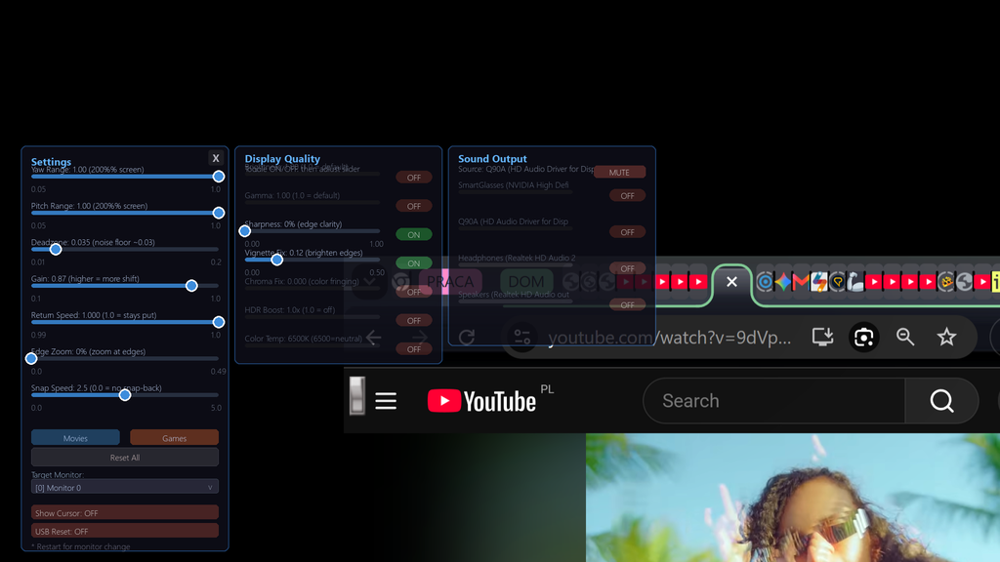

# AirPin Extended

**Pin your desktop in 3D space with RayNeo Air 4 Pro AR glasses.**

Put on the glasses. See your desktop floating in front of you. Turn your head - the screen stays where it is, like a virtual monitor pinned to the wall.

---

## Features

**Tracking**
- Head tracking with drift prevention (gyro deadzone + continuous auto-calibration)
- Yaw (left/right) always on, pitch (up/down) toggleable
- Smooth follow filter with snap-back and deadzone
- Recenter anytime with Ctrl+Alt+R

**Display Quality** *(Ctrl+Alt+S > Display tab)*
- Brightness, Gamma, Sharpness adjustment
- Vignette correction for lens edges
- Chromatic aberration fix
- HDR boost (ACES tone mapping)
- Color temperature control

**Multi-Device Audio** *(Ctrl+Alt+S > Sound tab)*
- Route system audio to glasses + TV simultaneously
- Per-device on/off, volume, and delay controls
- Mute source (TV) to listen only through glasses
- VB-Cable auto-detect for zero-latency sync (see Audio Setup)
- Works at any sample rate (48kHz recommended)

**Virtual Displays** *(Ctrl+Alt+Left/Right)* ⚠️ *not tested by maintainer*
- Add virtual screens left/right via Parsec VDD
- Each display captured and rendered independently
- Windows manages cursor between displays natively

**Other**
- Screenshots: Ctrl+Alt+X saves glasses view to screenshots/
- Edge zoom: text stays readable at screen edges
- Cursor adjusts for head tracking offset (no swim with zoom)
- Settings persist across restarts
- Two presets: Movies (wide, smooth) and Games (tight, snappy)

---

## Quick Start

### 1. What you need

- **RayNeo Air 4 Pro** AR glasses
- **HDMI + USB-A to USB-C** cable (both connections required)
- **Windows 10/11** PC or laptop
- **Python 3.10, 3.11, or 3.12** - [download 3.11.9 here](https://www.python.org/downloads/release/python-3119/)
- ⚠️ **Python 3.13+ does NOT work** - the screen capture library (dxcam) has no pre-built wheel for 3.13+. Use 3.11 or 3.12.
- ⚠️ Do NOT install Python from the Microsoft Store - it doesn't actually work. Use the python.org installer and check "Add python.exe to PATH" during install.

### 2. Download

Go to **[Releases](https://github.com/peterradzisz/Air4-Pro-Gyro-PC/releases/latest)** and download the **Source code (zip)**.

⚠️ **Before extracting**: Right-click the .zip > Properties > check **"Unblock"** > OK.
Windows marks downloaded files as untrusted, which can block the bundled DLLs from loading.
(setup.bat tries to auto-unblock, but doing it before extract is more reliable.)

Unzip anywhere (e.g. `C:\AirPin`). The IMU DLLs are already bundled in `lib\` - no extra downloads needed.

### 3. Run setup (first time only)

Double-click **`setup.bat`**. It will:

- Verify Python is installed and the right version
- Create a virtual environment in `.venv\`
- Install all dependencies from `requirements.txt`
- Verify the bundled DLLs

Takes 2-5 minutes. You only need to do this once.

`setup.bat` runs several checks before installing:
- Real Python (not Microsoft Store stub)
- 64-bit Python (DLLs are 64-bit only)
- Python 3.10-3.12 (3.13+ incompatible with dxcam)
- Unblocks downloaded files (MOTW)

Each check shows a clear error with a fix if it fails.

### 4. Connect the glasses

1. Plug **HDMI** into your GPU - glasses appear as a second display
2. Plug **USB-C** into your PC - sends head tracking data
3. Open **Windows Settings > System > Display**
4. Set glasses to **Extend** (not Duplicate)

### 5. Launch

Double-click **`run.bat`**. Put on the glasses. You should see your desktop. Turn your head left - the image shifts right.

> Wrong screen? Press Ctrl+Alt+S, change the monitor dropdown, restart.

### Which display is my glasses? (auto-detected)

AirPin automatically picks the **rightmost display** as the glasses target.
This works because Windows places newly-connected displays to the right by default.

**If your glasses are on the LEFT** (or you want a different display):
1. Press `Ctrl+Alt+S` to open Settings
2. Use the monitor dropdown to pick the correct display
3. Restart AirPin

Your choice is saved and remembered next time.

### Updating

After pulling new code, just run `run.bat` - it auto-detects missing deps and re-runs setup if needed. To force a clean install, delete the `.venv\` folder and run `setup.bat` again.

---

## Controls

All shortcuts: hold **Ctrl+Alt** then press the key.

| Key | Action | When to use |
|-----|--------|-------------|
| **R** | Recenter | Screen drifted |
| **S** | Settings | Open/close settings panel |
| **T** | Toggle tracking | Pause/resume head tracking |
| **P** | Toggle pitch | Enable/disable vertical tracking |
| **I** | Invert yaw | Flip left/right direction |
| **C** | Cursor on glasses | Show/hide cursor on AR display |
| **X** | Screenshot | Save glasses view to screenshots/ folder |
| **H** | Toggle HUD | Show/hide status info |
| **+/-** | Zoom in/out | Bigger/smaller image |
| **0** | Reset zoom | Back to 100% |
| **Left/Right** | Add display | Add virtual display panel left/right |
| **Shift+F** | Focus game | Give keyboard focus to the game |
| **Q** | Quit | Exit (removes virtual displays) |

**The 3 keys you need:** R (recenter), S (settings), T (pause tracking).

---

## Settings

Press **Ctrl+Alt+S** to open. Three tabs:

### Presets

| Preset | Best for | Settings |
|--------|----------|----------|
| **Movies** | Watching video | Wide range, smooth, edge zoom for text |
| **Games** | Gaming / RTS | Tight range, snappy, mild edge zoom |

### Tracking tab

| Setting | What it does |
|---------|-------------|
| **Yaw Range** | How far left/right the image can shift |
| **Pitch Range** | How far up/down (enable pitch with Ctrl+Alt+P) |
| **Deadzone** | Ignore tiny head movements. Higher = less jitter + less drift |
| **Gain** | How much image moves per degree of head turn |
| **Return Speed** | 1.000 = stays put. Lower = drifts back to center (prevents drift) |
| **Edge Zoom** | Zooms in at edges so text stays readable |
| **Snap Speed** | How fast image returns to center when you stop moving |

### Display tab

| Setting | What it does |
|---------|-------------|
| **Brightness** | Overall image brightness |
| **Gamma** | Mid-tone brightness curve |
| **Sharpness** | Edge enhancement for text clarity |
| **Vignette** | Darken edges to hide lens distortion |
| **Chromatic** | Fix color fringing at edges |
| **HDR Boost** | ACES tone mapping for expanded dynamic range |
| **Temperature** | Warm/cool color adjustment |

### Sound tab

| Control | What it does |
|---------|-------------|
| **Device on/off** | Enable audio routing to each output (glasses, TV, speakers) |
| **Volume** | Per-device volume slider |
| **Delay** | Per-device audio delay (0-500ms) |
| **MUTE** | Mute the source device (TV) so only glasses play |

---

## Audio Setup

### Option A: Simple (no install needed)

AirPin captures system audio and routes it to your glasses. Works on any PC.

**Limitation:** The glasses receive audio slightly after the TV. If both are audible, you hear a slight echo.

**To remove echo:** Press MUTE in Settings > Sound. Listen only through the glasses.

### Option B: VB-Cable (perfect TV + glasses sync)

[VB-Cable](https://vb-audio.com/Cable/) is a free virtual audio device that eliminates echo. AirPin auto-detects it.

**Setup (2 minutes):**

1. Download **VB-Cable** from <https://vb-audio.com/Cable/>
2. Run  as administrator
3. Reboot
4. Set Windows output to **CABLE Input**
5. Run AirPin - it shows: 
6. In Settings > Sound, enable both **TV** and **Glasses**

Now both play at the same latency. No echo.

---

## 3D games (optional)

AirPin shows a 2D screen. For real 3D, you need a tool that renders the game twice. The good news: they just work with AirPin. Enable 3D in the game, and AirPin captures the side-by-side output like any other frame.

### Easiest: drop-in DLL

Get [wiz3D](https://github.com/effcol/wiz3D), copy the matching DLL folder next to your game’s `.exe`, launch the game. Stereo turns on automatically.

Works great for DirectX 9 (hundreds of games). DirectX 10/11 is growing — Tomb Raider, Hitman Absolution, Battlefield 3, and more. DirectX 12 is coming. See the wiz3D page for the full list.

### Other options

- [Rendepth](https://github.com/outmode/rendepth-reshade) — ReShade add-on. Works on almost any modern game. More setup, broader coverage.
- [VRto3D](https://github.com/oneup03/VRto3D) — for games with VR mods (mostly Unreal Engine). Most setup, but true stereo with head tracking.

### Note

In 3D mode the mouse cursor stays a single dot, which can look odd on menus. wiz3D and Rendepth both have fixes for this.

---

## Troubleshooting

| Problem | Fix |
|---------|-----|
| Head tracking not working | Check USB cable. Ctrl+Alt+R to recenter |
| Screen drifts | Ctrl+Alt+R to recenter. Increase Deadzone. Lower Return Speed |
| Overlay on wrong screen | Ctrl+Alt+S > change monitor > restart |
| Cursor clicks miss target | Turn off pitch (Ctrl+Alt+P). Keep pitch OFF for gaming |
| No sound in glasses | Settings (Ctrl+Alt+S) > Sound > enable device |
| Audio jitters/stutters | Set Windows output to 48000Hz (not 192000Hz) |
| Audio echo vs TV | Install VB-Cable (see Audio Setup) or mute TV |
| Black screen | Use borderless windowed mode in game. For 3D, see [3D games](#3d-games-optional) above. |
| Double-click setup.bat does nothing | You have the Microsoft Store Python stub. Uninstall it, install real Python 3.11 from [python.org](https://www.python.org/downloads/release/python-3119/) |
| "dxcam has no pre-built wheel" in setup | You have Python 3.13+. Uninstall it, install Python 3.11 or 3.12 |
| "64-bit Python required" in setup | You have 32-bit Python. Uninstall it, install the 64-bit installer from python.org |
| DLL load failed / WinError 126 | Right-click the .zip > Properties > Unblock > re-extract. Or run setup.bat which auto-unblocks |
| Wrong display captured | Ctrl+Alt+S > monitor dropdown > pick glasses > restart |

---

## Credits

- **nomi-san** - original [AirPin](https://github.com/nomi-san/airpin) project
- **[arigandores](https://github.com/arigandores)** - extended display support
- **[verncat](https://github.com/verncat/RayNeo-Air-3S-Pro-OpenVR)** - RayNeoSDK and IMU
- **[Parsec VDD](https://github.com/nomi-san/parsec-vdd)** - Virtual display driver

## License

[CC BY-NC-ND 4.0](https://creativecommons.org/licenses/by-nc-nd/4.0/) - Peter Radziszewski
